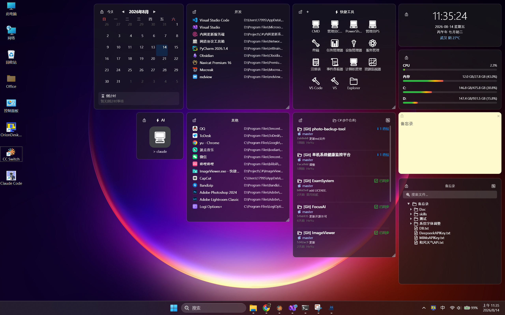

# OrionDesk - 桌面小组件

一个轻量级的 Windows 桌面小组件工具，让你在桌面上放置时钟、天气、系统监控、启动器等实用组件。组件固定在桌面图标层，不会遮挡应用程序窗口。

## 功能特性

### 组件

| 组件 | 功能 |
|------|------|
| **时钟** | 数字时钟、农历显示、天气信息、鼠标悬停查看详情 |
| **系统监控** | CPU/内存/硬盘使用率、渐变色进度条 |
| **启动器** | 拖拽添加应用、图标/列表两种视图、桌面图标智能隐藏 |
| **便签** | 多颜色便签、防抖自动保存 |
| **文件夹映射** | 树形目录结构、懒加载子目录、双击打开文件 |
| **版本控制监控** | 自动扫描 Git/SVN 仓库、显示同步状态（已同步/待推/待拉/分歧）、点击打开目录 |
| **快捷工具** | 开发者快捷操作中心：系统管理工具、开发环境入口、自定义快捷方式、管理员权限启动 |
| **日历事项** | 月视图日历、事项管理（工作/生活/纪念日/提醒）、重复事项、倒计时/正计时 |
| **CMD 启动器** | 大图标一键启动 CMD 并自动执行命令（可自定义图标/名称/命令/起始目录） |
| **文档中心** | 指定文档根目录、树形结构浏览、搜索、拖入归档、新建/重命名/删除文档和文件夹 |

### 天气系统

- 和风天气 API 集成（需自行申请 API Key）
- 实时天气 + 空气质量（AQI/PM2.5/PM10）
- 3 天天气预报
- 天气预警推送
- 生活指数（运动/洗车/穿衣/紫外线/感冒）
- 日出日落时间
- 支持 IP 自动定位或手动选择城市（内置 130+ 中国城市）
- 天气详情弹窗（右键菜单 → 天气详情）

### 桌面集成

- 组件固定在**桌面图标层**（图标之上、应用之下）
- 自由拖拽定位和调整大小
- 拖拽时自动吸附对齐（8px 阈值，调整大小时也自动吸附）
- 锁定功能（锁定后无法移动和调整）
- 配置持久化（同步写入 + 原子替换 + .gold 黄金备份）
- 开机自启动

### 视觉风格

- 深色毛玻璃背景、圆角边框、投影效果
- 自定义暗色控件（下拉框、日期选择器、滚动条）
- 统一的配色系统和控件样式
- 鼠标悬停透明度过渡动画

### 诊断监控

- 进程级指标实时监控（内存/GDI/USER/线程/句柄/GC）
- CSV 日志文件记录（按日分文件，位于 `logs/diagnostics_*.csv`）
- 诊断窗口（实时快照 + 历史趋势、异常高亮）
- 托盘右键 → 诊断 打开

## 技术栈

| 技术 | 用途 |
|------|------|
| .NET 10 | 运行时框架 |
| WPF | UI 框架 |
| Win32 API | 桌面层级控制（WorkerW）、文件拖放（WM_DROPFILES）、GDI/USER 句柄监控 |
| 和风天气 QWeather | 天气数据 |
| git / svn CLI | 版本控制仓库同步状态检查 |
| JSON | 配置存储（原子写入 + 备份） |

## 项目结构

```
OrionDesk/
├── src/
│   ├── OrionDesk.UI/               # 表现层 (WPF)
│   │   ├── Windows/
│   │   │   ├── BaseWidgetWindow.cs  # 组件基类（桌面层级、拖拽、吸附、锁定）
│   │   │   ├── ClockWidget.xaml     # 时钟 + 天气组件
│   │   │   ├── MonitorWidget.xaml   # 系统监控组件
│   │   │   ├── LauncherWidget.xaml  # 启动器组件
│   │   │   ├── StickyNoteWidget.xaml# 便签组件
│   │   │   ├── FolderWidget.xaml    # 文件夹映射组件
│   │   │   ├── GitSyncWidget.xaml   # 版本控制监控组件（Git + SVN）
│   │   │   ├── QuickToolsWidget.xaml  # 快捷工具组件
│   │   │   ├── CalendarWidget.xaml     # 日历事项组件
│   │   │   ├── CmdLauncherWidget.xaml  # CMD 启动器组件
│   │   │   ├── DocWidget.xaml         # 文档中心组件
│   │   │   ├── DiagnosticsWindow.xaml # 诊断监控窗口
│   │   │   ├── SettingsWindow.xaml  # 设置页面
│   │   │   ├── WeatherDetailWindow.xaml # 天气详情弹窗
│   │   │   ├── DocSettingsWindow.xaml   # 文件夹选择设置（文档中心/文件夹映射共用）
│   │   │   ├── EventEditWindow.xaml    # 事项编辑对话框
│   │   │   ├── EventListWindow.xaml    # 事项列表弹窗
│   │   │   ├── QuickToolEditWindow.xaml # 快捷工具编辑对话框
│   │   │   ├── CmdLauncherSettingsWindow.xaml # CMD 启动器设置
│   │   │   └── InputDialog.xaml        # 通用输入对话框
│   │   ├── Controls/
│   │   │   ├── DarkComboBox.xaml    # 自定义暗色下拉框
│   │   │   └── DarkDatePicker.xaml  # 自定义暗色日期选择器
│   │   ├── App.xaml                 # 全局样式和配色
│   │   └── MainWindow.xaml          # 托盘管理
│   │
│   ├── OrionDesk.BLL/              # 业务逻辑层
│   │   ├── Models/                  # 数据模型
│   │   └── Services/                # 业务服务（天气/监控/农历/Git+SVN/诊断/组件管理）
│   │
│   └── OrionDesk.DAL/              # 数据访问层
│       ├── ConfigRepository.cs      # JSON 配置读写
│       └── DataPath.cs              # 路径管理
│
├── publish/                         # 便携版发布（自包含单文件）
└── .skills/                         # 项目状态管理
```

## 使用方法

### 快速开始

1. 下载 `publish/OrionDesk.UI.exe`（便携版，无需安装 .NET）
2. 双击运行，系统托盘出现 OrionDesk 图标
3. 右键托盘图标 → 添加组件 → 选择需要的组件
4. 右键托盘图标 → 设置 → 配置天气 API Key 和城市

### 各组件使用说明

**时钟组件**
- 右键 → 天气详情（需先在设置中配置天气 API Key）
- 鼠标悬停显示天气详细信息（温度、湿度、风向等）
- 右键 → 显示日期/农历/天气 开关
- 农历日期自动显示

**系统监控组件**
- 自动显示 CPU/内存/硬盘使用率
- 渐变色进度条（绿→黄→红）

**启动器组件**
- 从桌面或文件管理器拖拽应用到组件上添加
- 右键 → 图标视图/列表视图切换
- 右键 → 重命名
- 列表视图下右键 → 删除
- 启动器中的应用会自动隐藏桌面图标（退出 OrionDesk 后恢复）

**便签组件**
- 直接输入文字，自动防抖保存
- 右键 → 更换颜色

**文件夹映射组件**
- 右键 → 设置 → 选择文件夹路径，或直接拖入文件夹
- 点击展开/折叠子目录
- 双击打开文件

**版本控制监控**
- 拖入文件夹自动扫描 Git/SVN 仓库
- 拖入单个仓库直接添加
- 状态显示：✅已同步 / ⬆待推 / ⬇待拉 / ⚠分歧 / ❌错误
- 点击仓库名打开对应目录
- Git 和 SVN 仓库自动识别，显示 [Git]/[SVN] 标签

**快捷工具**
- 默认提供 16 个常用工具（系统管理 + 开发工具）
- 点击工具图标直接启动
- 右键 → 添加工具（支持应用程序/文件夹/URL/Shell 命令 4 种类型）
- 右键已有工具 → 编辑/删除/以管理员身份运行
- 管理员权限启动会弹出 UAC 提示

**日历事项**
- 点击日期添加事项（支持全天/具体时间）
- 事项类型：🔴工作 🟢生活 🔵纪念日 🟡提醒
- 支持重复：不重复/每天/每周/每月/每年
- 有事项的日期显示颜色圆点标记
- 点击有事项的日期 → 事项列表（可编辑/删除）
- 组件底部显示倒计时（最近 5 个未来事项）

**CMD 启动器**
- 点击大图标启动 CMD 并自动执行命令
- 右键 → 设置 → 配置显示名称、图标（emoji）、启动命令、起始目录
- 默认执行 `claude`，起始目录 `C:\WINDOWS\system32`

**文档中心**
- 右键 → 设置 → 选择文档根目录
- 树形结构浏览文件夹和文件
- 顶部搜索框实时过滤文件名
- 从 Windows 拖入文件/文件夹 → 移动到当前目录（归档）
- 右键文件夹 → 新建 Markdown/文本文档/文件夹、重命名、删除、用资源管理器打开
- 右键文件 → 打开、复制路径、重命名、删除
- 双击文件用默认程序打开

**诊断监控**
- 托盘右键 → 诊断 → 打开诊断窗口
- 实时显示进程内存/GDI/USER/线程/句柄/GC 指标
- 自动每 5 分钟采集一次
- 历史趋势列表（GDI>500/USER>300 红色高亮）
- CSV 日志文件记录在 `%LocalAppData%\OrionDesk\logs\`

### 通用操作

| 操作 | 方法 |
|------|------|
| 移动组件 | 鼠标按住组件空白区域拖拽 |
| 调整大小 | 拖拽组件右下角（自动吸附对齐） |
| 切换样式 | 右键组件 → 菜单选项 |
| 锁定组件 | 右键 → 锁定，或点击左上角锁图标 🔒 |
| 添加组件 | 右键托盘图标 → 添加组件 |
| 删除组件 | 右键组件 → 关闭组件 |
| 隐藏全部 | 右键托盘图标 → 隐藏所有组件 / 双击托盘图标 |
| 开机启动 | 右键托盘图标 → 开机启动 |

## 数据目录

| 文件 | 位置 |
|------|------|
| 配置文件 | `%LocalAppData%\OrionDesk\config.json` |
| 诊断日志 | `%LocalAppData%\OrionDesk\logs\diagnostics_*.csv` |
| 启动日志 | `%LocalAppData%\OrionDesk\startup.log` |

## 许可证

ISC License — Copyright (c) 2026 星月拾貳
